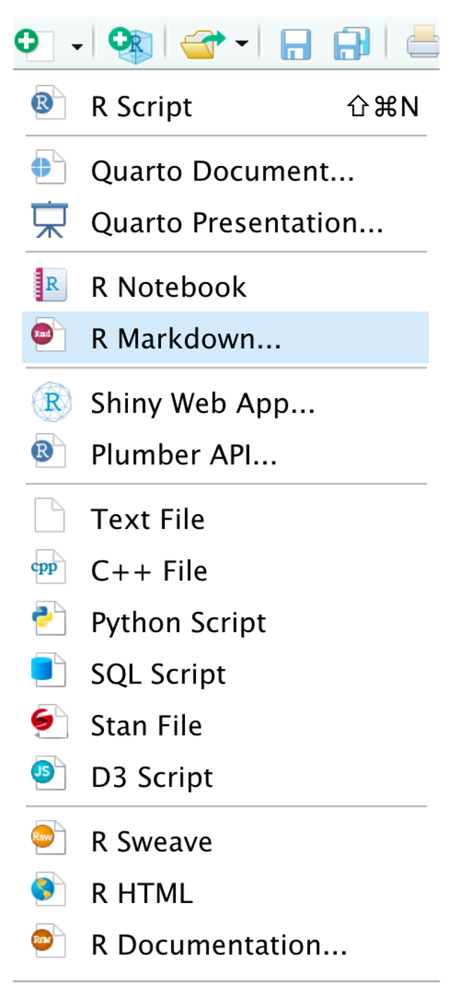
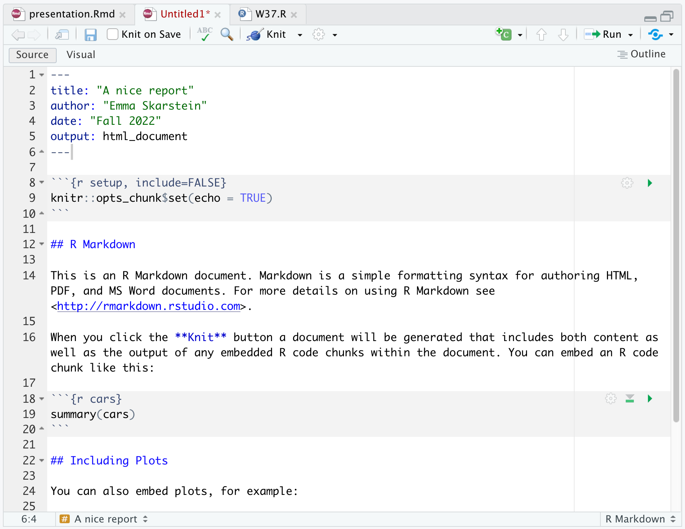

```{r setup, include=FALSE}
options(htmltools.dir.version = FALSE, warning = FALSE, message = FALSE)
```

```{r xaringan-themer, include=FALSE, warning=FALSE}
library(xaringanthemer)
style_solarized_light()
```

# Goal for today

Overall

- **Create reproducible reports in R using Rmarkdown**

--

In addition, we will learn how to

- make beautiful plots in ***ggplot2***
- use ***Github*** for collaboration


---
class: inverse, center, middle

# Get Started with **R Markdown**

---
# Why R Markdown?

1. R code can be directly integrated in the report
2. Useful for anyone who uses R and wants to communicate results
3. With numerous packages that build on it, it is really easy to create beautiful reports, slides, websites, etc.

**Examples**

- [I made an R Markdown file to explain the code for my **master thesis**](https://htmlpreview.github.io/?https://github.com/emmaSkarstein/Citizen_Science_Skarstein_master/blob/master/reports/Short_version_master.html)
- [**Supplementary material** for academic articles](https://github.com/emmaSkarstein/ISBA2022-Poster/tree/main/Simulation_example)
- [Using R packages and education to scale Data Science at **Airbnb**](https://medium.com/airbnb-engineering/using-r-packages-and-education-to-scale-data-science-at-airbnb-906faa58e12d)

---
# First steps

Download the `rmarkdown` package:
```{r download-rmarkdown, eval = FALSE}
install.packages("rmarkdown")
```

.pull-left[
Then, in R Studio, click the new-document-button, and choose "R Markdown".

Enter the title you want, and you now have an R Markdown document!
]

.pull-right[
```{r, echo=FALSE, out.width="40%"}

```
]

---
# Try it yourself

Open RStudio and create an R Markdown document.

- Name it whatever you want
- Choose **HTML** to start with

```{r, echo = FALSE}
library(countdown)
countdown(minutes = 2, 
          bottom = 0)
```

---
# Structure of an R Markdown document

.pull-left[
The **YAML** is the part at the top in between "---"

Some things you could add:
- subtitle
- if making a PDF, this is where you could [add LaTeX packages](https://bookdown.org/yihui/rmarkdown-cookbook/latex-extra.html#loading-latex-packages)

**The body** begins with the `setup` chunk, here we can specify global options.

Look at the template: section titles and code chunks
]


.pull-right[

]

---
# Code chunks

.pull-left[
***Lifesaver:*** Shortcut for creating code chunk is 
.small[
- Windows/Linux: **Ctrl+Alt+I**
- macOS: **Command+Option+I**

[You can find more keyboard shortcuts here.](https://bookdown.org/yihui/rmarkdown-cookbook/rstudio-shortcuts.html)
 ]

Note the options in the curly-brackets:
.small[
- `include = FALSE`: code and results will not be shown, but the code will be run.
- `echo = FALSE`: hides the code, but not the results (useful for figures).
- `eval = FALSE`: code is shown, but not run. 
- `message = FALSE`: hides messages generated by code (useful for when loading packages).
- `warning = FALSE`: hides warnings generated by code
- `fig.cap = "..."`: Sets figure caption for figure generated in that chunk
- `out.width="x%"`: Scales the figure size with x%
 ]
]

.pull-right[

Chunk options can be set *globally* in the `setup` chunk if you want them to apply to all code chunks.
]

---
# Try it yourself

- Knit the template R Markdown file that is generated automatically for you. 
- Feel free to change the chunk options and change what is visible.

```{r, echo = FALSE}
library(countdown)
countdown(minutes = 2, 
          bottom = 0)
```

---
# Including formulas

**In-line formula:** `$X \sim Pois(\lambda)$` becomes $X \sim Pois(\lambda)$.

**Equation on separate line: **

`$$` `X \sim Pois(\lambda)$$` becomes

$$
X \sim Pois(\lambda)
$$
**Equation aligned over several lines: **

Use `\begin{aligned}` and `\end{aligned}`.

`$$`
`\begin{aligned}` ` X &\sim \\ &Pois(\lambda) \end{aligned}$$` 

becomes
$$\begin{aligned} X &\sim \\ &Pois(\lambda) \end{aligned}$$
---
# Knitting the document

To create the document, press the **Knit** button.

For courses at NTNU, we generally want you to hand in **PDF** documents, since that lets us view comment in your file directly in Blackboard. 

[In order to create a PDF document](https://bookdown.org/yihui/rmarkdown-cookbook/install-latex.html), you will need to have a LaTeX distribution installed. One option is TinyTeX, which you can install easily with the R package tinytex:

```{r eval = FALSE}
tinytex::install_tinytex()
```

.pull-left[
**HTML document**

```yaml
---
title: "A nice report"
author: "Emma Skarstein"
date: "Fall 2022"
output: html_document 
---
```
]

.pull-right[
**PDF document**

```yaml
---
title: "A nice report"
author: "Emma Skarstein"
date: "Fall 2022"
output: pdf_document
---
```
]

---
# Resources

You now should know enough to be able to use R Markdown for this course! There are tons of resources out there, and if you have any problems someone has most likely had the same problem before you, so you can solve most issues by googling.

Here are also some resources that cover R Markdown, both the very basic level and some very advanced stuff.

[**R Markdown tutorial** from RStudio](https://rmarkdown.rstudio.com/lesson-1.html)

[**R Markdown Cookbook** by Yihui Xie, Christophe Dervieux, Emily Riederer](https://bookdown.org/yihui/rmarkdown-cookbook/)  - has many short, practical examples, I link to several in this presentation!

[**R Markdown: The Definitive Guide** by Yihui Xie, J. J. Allaire, Garrett Grolemund](https://bookdown.org/yihui/rmarkdown/) - Chapter 2 should be sufficient for this course

[**R Markdown Cheatsheet**](https://www.rstudio.com/wp-content/uploads/2015/02/rmarkdown-cheatsheet.pdf) 

---
# Further opportunities with R Markdown
(Note: This is super optional, and just if you find it fun. You absolutely do not need anything more than the basic report in this course.)

- [Presentation slides](https://rmarkdown.rstudio.com/lesson-11.html) with `beamer`, `ioslides`, `slidy` or others.
  - This presentation was made in R Markdown using [`Xaringan`](https://bookdown.org/yihui/rmarkdown/xaringan.html)

- Basic webpage with [`postcards`](https://github.com/seankross/postcards)

- Websites/blogs with [`Distill`](https://rstudio.github.io/distill/website.html) (can also be combined with `postcards`.)

- Many of templates for paged HTML documents (thesis, CV, poster, etc.) with [`pagedown`](https://github.com/rstudio/pagedown) 


---
class: inverse, center, middle

# Get Started with `ggplot2`

---
# Why `ggplot2`?

- It gives you a recognizable system - when you have understood the structure of `ggplot2` it is very easy to understand how to modify things to get exactly the plot you want. 

---
# First steps

Install the `ggplot2` package:

```{r, eval = FALSE}
install.packages("ggplot2")
```

Load the package:

```{r}
library(ggplot2)
```

For this tutorial, I'll use the `palmerpenguins` dataset, which you can install and load in the same way:

```{r eval = FALSE}
install.packages("palmerpenguins")
```
```{r}
library(palmerpenguins)
```

---
# A simple plot

Let's first take a look at the structure of our data.

```{r}
head(penguins)
```


```{r}
names(penguins)
```

---
# A simple plot

```{r, eval = FALSE}
ggplot(data = penguins, 
       aes(x = flipper_length_mm, y = body_mass_g))
```
.pull-left[
```{r, echo = FALSE, out.width="90%"}
ggplot(data = penguins, 
       aes(x = flipper_length_mm, y = body_mass_g))
```
]
.pull-right[
Lets say we want to plot the flipper length against body mass. We use the `ggplot()` function, and specify the data set, and what we want on the x- and y-axis. If we run this, we see the initialized plot.
]

---
# A simple plot - Adding points

```{r eval = FALSE}
ggplot(data = penguins, 
       aes(x = flipper_length_mm, y = body_mass_g)) +
  geom_point() #<<
```

.pull-left[
```{r echo = FALSE, warning = FALSE, out.width="90%"}
ggplot(data = penguins, 
       aes(x = flipper_length_mm, y = body_mass_g)) +
  geom_point()
```
]

.pull-right[
To get the actual data on the plot, we need to specify `geom_point()`. The layers of a `ggplot` are added together with a **`+`**. 
]

---
# A simple plot - Color by species

```{r eval = FALSE}
ggplot(data = penguins, 
       aes(x = flipper_length_mm, y = body_mass_g)) +
  geom_point(aes(color = species)) #<<
```

.pull-left[
```{r echo = FALSE, warning = FALSE, out.width="90%"}
ggplot(data = penguins, 
       aes(x = flipper_length_mm, y = body_mass_g)) +
  geom_point(aes(color = species)) #<<
```
]

.pull-right[
To color the points by species, add `aes(color = species)` inside `geom_point()`. 
]

---
# A simple plot - Themes

```{r eval = FALSE}
ggplot(data = penguins, 
       aes(x = flipper_length_mm, y = body_mass_g)) +
  geom_point(aes(color = species)) +
  theme_minimal() #<<
```

.pull-left[
```{r echo = FALSE, warning = FALSE, out.width="90%"}
ggplot(data = penguins, 
       aes(x = flipper_length_mm, y = body_mass_g)) +
  geom_point(aes(color = species)) +
  theme_bw() #<<
```
]

.pull-right[
We can make changes to the layout of the plot by specifying a different theme. The default is `theme_gray()`, let's change it to `theme_bw()`. 
]

---
# A simple plot - Color palettes

```{r eval = FALSE}
ggplot(data = penguins, 
       aes(x = flipper_length_mm, y = body_mass_g)) +
  geom_point(aes(color = species)) +
  scale_color_manual(values = c("orange", "darkcyan", "hotpink"))
  theme_minimal() 
```

.pull-left[
```{r echo = FALSE, warning = FALSE, out.width="90%"}
ggplot(data = penguins, 
       aes(x = flipper_length_mm, y = body_mass_g)) +
  geom_point(aes(color = species)) +
  theme_bw() #<<
```
]

.pull-right[
The color palette can be changed through `scale_color_...()`. In this case, we want to specify manual values for the colors, but you could also use ready-made color palettes, [there are lots of them!](https://emilhvitfeldt.github.io/r-color-palettes/discrete.html)
]

---

# A simple plot - Fonts

```{r message = FALSE, warning = FALSE}
library(showtext)
showtext_auto()
font_add_google(name = "Josefin Sans", family = "Josefin Sans")
```

The package `showtext` is great for changing fonts.

---

# A simple plot - Fonts

```{r eval = FALSE}
ggplot(data = penguins, 
       aes(x = flipper_length_mm, y = body_mass_g)) +
  geom_point(aes(color = species)) +
  scale_color_manual(values = c("orange", "darkcyan", "hotpink")) +
  theme_bw() +
  theme(text = element_text(family = "Josefin Sans"))
```

.pull-left[
```{r echo = FALSE, message = FALSE, warning = FALSE, out.width="90%"}
ggplot(data = penguins, 
       aes(x = flipper_length_mm, y = body_mass_g)) +
  geom_point(aes(color = species)) +
  scale_color_manual(values = c("orange", "darkcyan", "hotpink")) +
  theme_bw() +
  theme(text = element_text(family = "Josefin Sans"))
```
]

.pull-right[
Just putting some text here now
]

---
# More penguin plots

You can see some more examples of `ggplot2` plots with the `palmerpenguin` data [here](https://allisonhorst.github.io/palmerpenguins/articles/examples.html).


---

class: center, middle

# Thanks!

Slides created via the R package [`xaringan`](https://github.com/yihui/xaringan).

